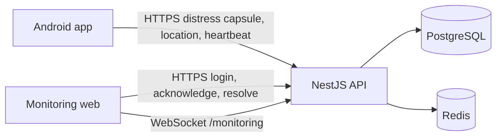
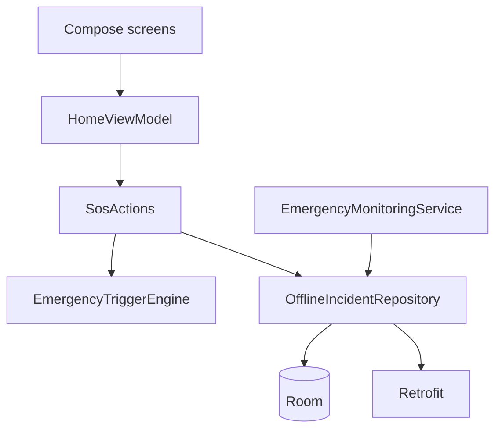

# Architecture

Milestone 1 is an offline-first deliberate SOS. A person presses SOS. The phone writes the incident before it talks to the network. The server creates exactly one incident for that trigger. An operator watches location and heartbeats and can acknowledge or resolve the incident. Risk scoring and AI do not sit on that path.

## System

Redis is used for a health ping and, when it is reachable, a Socket.IO adapter. Creating an SOS does not require Redis. If PostgreSQL is down, `/api/v1/health` returns 503.

## Android modules

`:core` is a plain JVM library. It has no Android imports. It owns the trigger decision, distress-capsule size check, offline queue policy, protection-health rules, battery-mode thresholds, and a rule-based safety fusion engine. The fusion engine is tested and is not called when the user presses SOS.

`:app` is the Android application. It holds the Compose UI, Room database, Retrofit client, encrypted token store, location foreground service, and WorkManager flush. Hilt binds those Android types to the interfaces the home screen uses.

## Trigger rule

`EmergencyTriggerEngine` accepts a trigger event. These types create an incident immediately:

- `VOLUME_BUTTON`
- `VOICE_SAFE_WORD`
- `MANUAL_SOS`
- `DURESS`

Only `MANUAL_SOS` can be produced by the phone in this version. The other three are accepted by the engine and the API so later triggers do not need a new decision path. The API rejects every other trigger type with `422 FUSION_NOT_ENABLED` and does not create an incident.

A low confidence value does not delay a deliberate trigger.

## Idempotency

`triggerId` is the idempotency key. The phone generates it once and retries the same body. The server stores a SHA-256 of the canonical JSON body.

- Same `triggerId` and same body: `200` and the original incident, header `Idempotent-Replayed: true`.
- Same `triggerId` and a different body: `409 IDEMPOTENCY_CONFLICT`.
- A unique-constraint race re-reads the row and returns the original incident.

Location points use `clientPointId`. Heartbeats use `clientHeartbeatId`. A duplicate does not overwrite the stored point or heartbeat.

## Upload priority

The phone queue classifies work as `CRITICAL`, `HIGH`, `NORMAL`, or `BULK`. This version only enqueues critical work: the distress capsule, location points, and heartbeats. Audio, photos, and video are not captured. Critical retries back off up to 30 seconds. The other classes, when they exist, cap at 5 minutes.

The distress capsule is rejected above 2048 bytes.

## Contact loss

A sweep every 15 seconds marks an active incident `DEVICE_CONTACT_LOST` when no heartbeat arrives within `HEARTBEAT_STALE_AFTER_SECONDS` (default 45). The incident state stays `SOS` or whatever state it already had. The last location, speed, heading, and battery stay on the incident. A later heartbeat sets contact back to `ONLINE`. The system does not treat contact loss as proof of kidnapping.

## Realtime

Operators join Socket.IO namespace `/monitoring` by sending `{ "token": "<access token>" }`. The server loads the user from the database and admits only roles that can read active incidents. The socket is a notification channel. Acknowledge and resolve stay on HTTPS.

Events emitted now:

- `incident.created`
- `incident.acknowledged`
- `incident.resolved`
- `location.updated`
- `heartbeat.updated`
- `device.offline`

`incident.updated`, `evidence.received`, `risk.updated`, `duress.detected`, `guardian.notified`, and `responder.assigned` are named in shared types and are not emitted.

## Monitoring web

React, Vite, Tailwind, TanStack Query, and Leaflet. The access token stays in memory. The refresh token is an httpOnly `SameSite=Strict` cookie on `/api/v1/auth`. The map labels the last confirmed location. It does not calculate a search corridor and it does not say where a person is unless a location point was stored.

## What is deliberately absent

- No AccessibilityService, microphone capture, camera capture, or background-location permission.
- No SMS sending. `SimulatedSmsProvider` records a message and returns `delivered: false`. Incident dispatch does not call it.
- No AI assistant and no search-corridor implementation.
- No guardian, evidence, duress-PIN, or journey APIs.
- `SafetyFusionEngine` exists as a library with configurable rules and stored reasons. It cannot open or cancel an incident.
