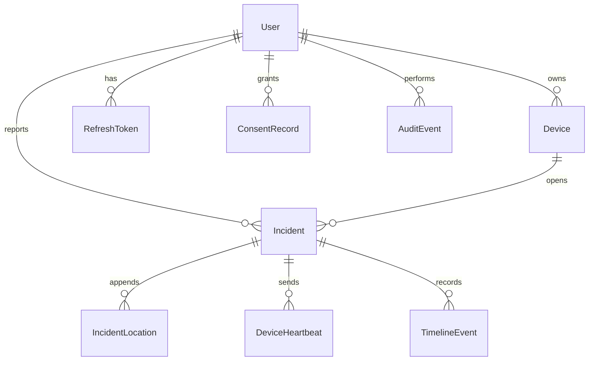

# Data model

PostgreSQL via Prisma. Identifiers are UUIDs. The migration is `services/api/prisma/migrations/20261001120000_init`.

## Tables in this version

| Table | Role |
| --- | --- |
| User | Account. Public registration is always role `USER`. Password hash only. |
| RefreshToken | SHA-256 of the opaque refresh token, family id, revocation, replacement. |
| ConsentRecord | Registration stores purpose `SAFETY_LOCATION_AND_INCIDENT`, version `2026-10-01`, granted true. |
| Device | One row per user and `devicePublicId`. Platform stored as `ANDROID`. |
| Incident | One row per `triggerId`. Capsule JSON, last-position cache, contact status, test and duress flags, correlation id. |
| IncidentLocation | Append-only. Unique `(incidentId, clientPointId)`. |
| DeviceHeartbeat | Append-only. Unique `(incidentId, clientHeartbeatId)`. |
| TimelineEvent | Human-readable incident history. |
| AuditEvent | Operator and system actions. Metadata must not contain secrets. |

Incident rows are updated for state, contact, and the last-position cache. Location points and heartbeats are not updated in place. A repeated client id is ignored.

## Not migrated yet

These were specified for later milestones and have no tables:

TrustedContact, ProtectionSession, TriggerEvent, RiskSignal, EvidenceObject, DuressEvent, Notification, Responder, ResponderAction, IncidentNote, SafeWordConfiguration, VehicleJourneyProfile.

Operator notes on acknowledge and resolve are written into the timeline message. They are not a separate note table.

## Correlation

`correlationId` is generated on the phone and stored on the incident. Audit rows copy it. Logs should include the request id and the correlation id, and should not include passwords, tokens, PINs, or audio.
