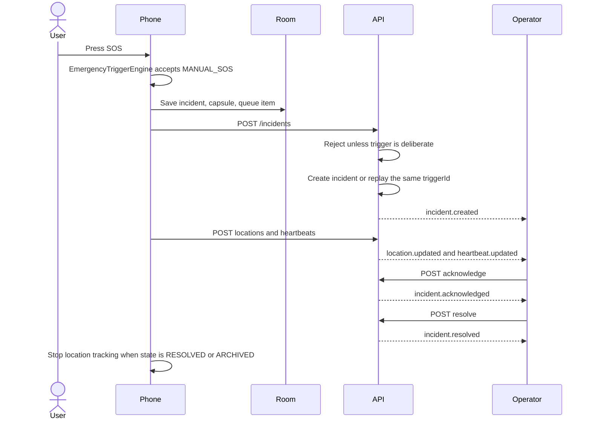

# Incident flow

A deliberate SOS does not wait for a model, a risk score, or a network round trip on the phone.

## States

The stored states are `PROTECTED`, `CONCERN`, `HIGH_RISK`, `SOS`, `ACKNOWLEDGED`, `RESPONDING`, `USER_LOCATED`, `RESOLVED`, and `ARCHIVED`.

This version only moves an incident through the endpoints that exist:

| Action | Allowed from | Result |
| --- | --- | --- |
| Create deliberate SOS | none | `SOS` |
| Acknowledge | `SOS` | `ACKNOWLEDGED` |
| Resolve | `SOS` or `ACKNOWLEDGED` | `RESOLVED` |

The transition table also lists `RESPONDING`, `USER_LOCATED`, and `ARCHIVED`, but there is no endpoint that performs those moves yet. A user cannot acknowledge an incident. A cancel PIN can resolve one.

`duress` is stored when the distress capsule says `duress: true`, and also when the duress PIN is used on cancel. The phone always shows "Emergency cancelled". The incident stays open and the dashboard shows `POSSIBLE FORCED CANCELLATION`. That label is a signal for an operator, not a finding that someone was forced. A cancel PIN resolves the incident.

A second deliberate trigger while an incident is still open does not create another incident. It is stored as an escalation on the open one. A real SOS promotes a test incident.

## Test sessions

There is no persistent practice switch. Settings starts a test session that expires after 10 minutes. SOS during that window is `isTest: true`. Summary counts exclude test incidents. `highRiskAlerts` and `respondersActive` are `null` because those counts are not calculated.

## Offline

If the POST fails, the incident remains in Room and WorkManager retries. The same `triggerId` is reused. Duplicate retries do not create a second incident.

If location is missing, the capsule still sends. Latitude and longitude are both null, and `lastKnownLocation` may carry an older point when the phone has one that is older than two minutes.

## Heartbeat loss

Missing heartbeats set `contactStatus` to `DEVICE_CONTACT_LOST` and emit `device.offline`. The incident state does not change. The last confirmed position remains the last appended location that won the `lastPositionAt` comparison. Older points are not deleted.
